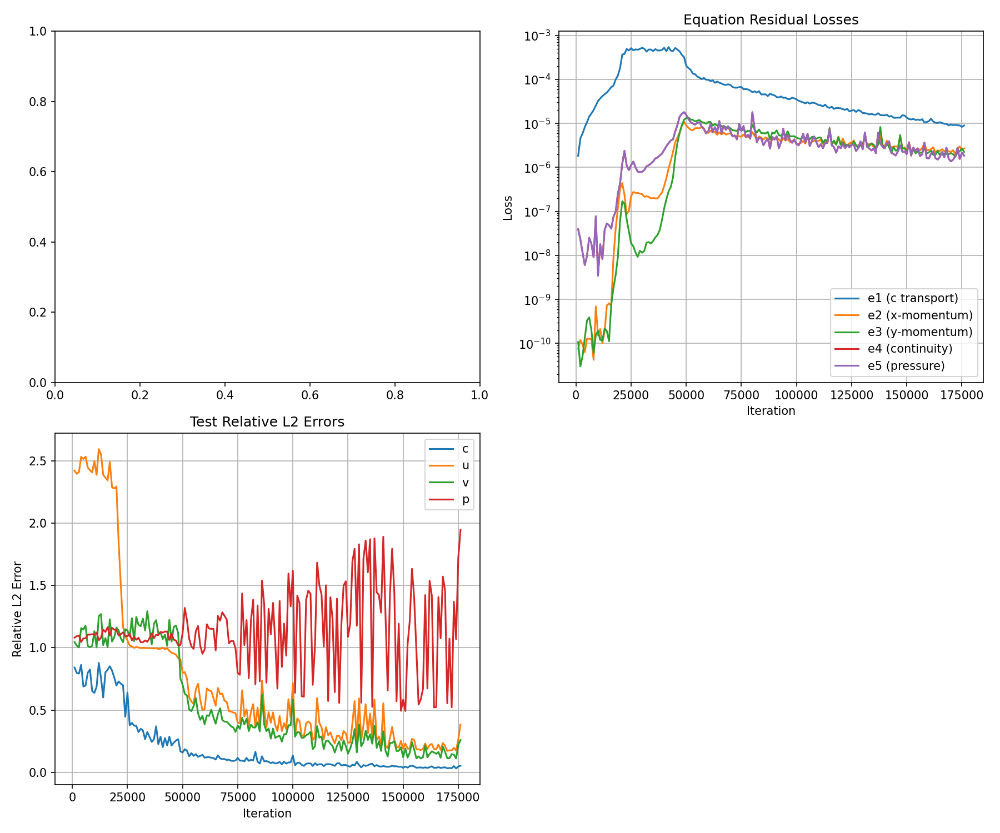
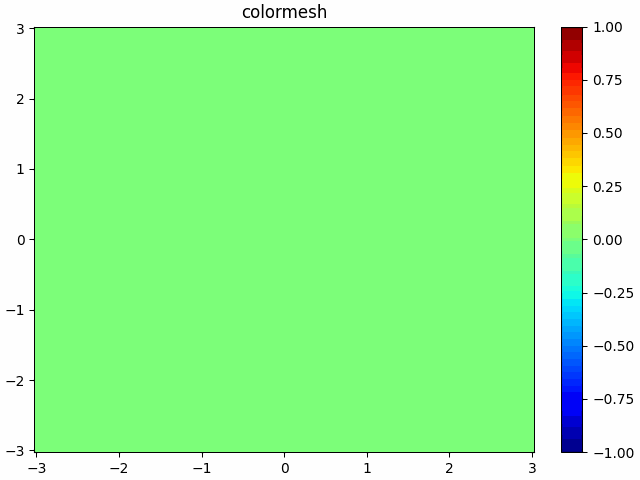
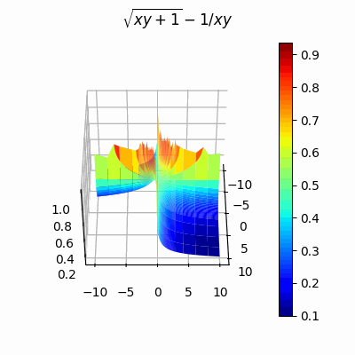

# HFM-study
personal HFM study material
## 1.简介
- 基于Pytorch的Hidden Fluid Mechanics模型研究仓库
- 注：原论文模型基于Tensorflow构建（[链接](https://github.com/maziarraissi/HFM)），此处采用Pytorch的版本（[链接](https://github.com/kimy-de/HFM)）
- 训练模型使用Cloud Studio的Pytorch应用
- 研究推进主要依赖的ai为deepseek

## 2.备注
- 关于Pytorch的选择：
原论文附件中说使用Tensorflow是因为有静态图，但Pytorch 2.x版本中已经更新了静态图选项，而且学习深度学习时主要用的是Pytorch，比Tensorflow更熟悉
- 模型运行中的阶段结果存储在此仓库的./image/p和./image/swish中
- 目前还在做的内容：
  + 基于matplotlib的流场可视化
  + PINNs原论文、综述原文阅读
  + 目前以Deepseek为主，千问其次，暂时还未使用过国外AI（chatgpt，gemini等）
- 与AI讨论的主要内容精简后放在第四部分（主要内容为AI所提供的建议和思路）（由deepseek根据上文总结）

## 3.更新
- 2026/2/16 把激活函数改成了可以学习参数的swish（即x * sigmoid(beta * x)）（模型版本：swish）
- 2026/2/17 训练模型
- 2026/2/18 训练模型至6、12小时（约68000次迭代）
  + 问题：p的收敛显著慢于c、u和v
  + 可能可用的解决方法：提高e的损失在总损失中的占比
  + 2026/2/19 训练模型至18小时
  + 修改：损失函数改为loss = 0.1 * $loss_c$ + 0.9 * $loss_e$
  + 问题：p几乎收敛到1.8不动了，不太对劲
  + 可用方法：考虑用L-BFGS优化器训练数十轮
- 2026/2/20 优化、修改模型（新模型版本：p）
  + 使用L-BFGS优化器训练了10轮（分别采用30k和60k样本量）p的损失几乎没有变化
  + 给loss_c和每一个e的loss添加了可学习的权重
  + 引入压力泊松方程得到的e_5对压力进行约束
  + 压力泊松方程得到的e：$e5 = p_xx + p_yy + (u_x ^ 2 + 2 * u_y * v_x + v_y ^ 2)$
  + 在新模型中同时引入对迭代次数和相对l2误差、损失函数的记录（保存在log中）
- 2026/2/21 训练模型12小时（至58000次迭代）对p的约束有效
- 2026/2/22 训练模型6小时（至88000次迭代）和6小时（至117000次迭代）
  + 对p误差随迭代次数的下降有效，但p的误差震荡的很明显
  + 比原论文随迭代次数下降的慢
- 2026/2/24 训练模型6小时（至147000次迭代）
  + 误差波动的更加明显（尤其是p，在0.5至1.5之间波动）
  + 注意到总损失一直在下降
  + 可能的解决方案：将权重约束在-5到5之间防止权重过大或者过小
  + 本来计划停止训练，但决定修改后明天再训练6小时
- 2026/2/25 训练模型6小时（至175000次迭代）
  + 误差依然波动的很厉害但是最小值在下降
  + 结束模型训练并绘制迭代次数与损失、误差的关系图
  + 奇怪的是随着迭代次数增加p的误差波动的越来越明显
  
  + 和ai（deepseek）讨论后决定先尝试做一个可视化观察一下流场排除复杂度的问题（matplotlib）
- 2026/3/2 和上一届的学长交流了一下，被推荐了一篇[综述](https://mp.weixin.qq.com/s/zu5CUaSXRjM1BP_ZL0tAwA)
- 2026/3/3 阅读综述，了解了有关传统仿真的内容
- 2026/3/4 学习matplotlib（集中在分层设色图和动画相关内容上）

## 4.AI对话精简
- **代码错误诊断**：指出数据索引范围错误（仅采样前 `num_samples` 点）和激活函数缺失（`LinearBlock` 无激活），导致训练失效和网络表达能力不足。  
- **自适应加权解释**：阐明损失函数 `0.5e^{-w}loss + 0.5w` 源于多任务不确定性加权，并建议对可训练权重 `w` 施加范围约束（如 `clamp(-5,5)`）以防止极端值引发训练震荡。  
- **训练稳定性优化**：提出降低 `w` 学习率、将权重保存至 checkpoint 以便断点续训、监控 `w` 和 `beta` 值。  
- **误差波动分析**：归因于测试快照随机、数据采样不全、`w` 无约束等因素，建议固定测试快照、分离训练/测试点误差以评估泛化能力。  
- **可视化指导**：提供 `.mat` 数据转换为规则网格的方法，以及使用 `matplotlib` 绘制静态场图和动画的完整代码示例。  
- **网络结构澄清**：说明模型无残差连接，额外参数极少（17个），并非波动主因，并给出添加残差的可选方案。
根据本次对话中提供的新信息（去除文档中已总结部分）：
- **可学习β Swish的调参原理**：解释β梯度尺度与输入归一化的关系，建议初始化β=1，学习率与主网络一致（1e-4），并监控β值范围防止极端值（>10或<0.1）。
- **浓度梯度充足免边界条件的物理数学解释**：输运方程通过∇c将速度信息编码在c的时空变化中，内部PDE残差约束可传播至边界，因此无需显式速度边界条件。
- **静态图对比与PyTorch现状**：补充TensorFlow静态图与PyTorch 2.x `torch.compile` 的差异，说明当前PyTorch可通过编译实现类似优化。
- **物理信息网络结构图解**：详细说明自动微分如何构建残差网络(e1-e5)，以及微分算子作为“激活层”的概念。
- **L-BFGS直接使用的风险分析**：从收敛特性（易陷局部极小）、全批量要求（显存压力）、数值精度（FP32舍入误差致伪收敛）三方面解释为何不宜从头使用L-BFGS。
- **p误差停滞的多因素诊断**：补充损失权重失衡（loss_c主导）、残差点采样位置不当（未覆盖压力梯度区）、压力可加性常数误解（若分布形态错误仍可高误差）、Re/Pe设置错误等排查方向。
- **L-BFGS微调的显存预估**：给出float32下全批量(157879点)的峰值显存估算(≈4-5GB)，并说明double精度会使需求翻倍。
- **精细对比压力场的方法**：提供空间分布（云图、差场、横截面）、统计量（均值/方差、直方图、相关性散点）、梯度比较、频谱分析、时间演化等多维度诊断手段。
- **优化方案扩展**：包括输出层个性化缩放、压力泊松方程引入、残差点自适应采样、课程学习策略等。
